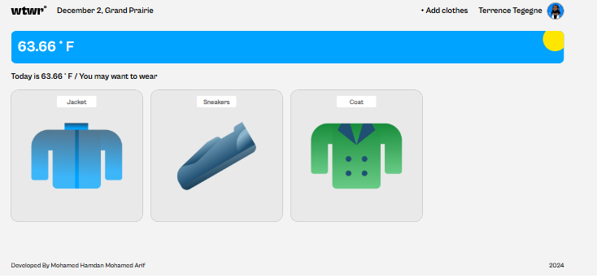
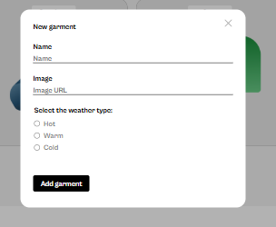
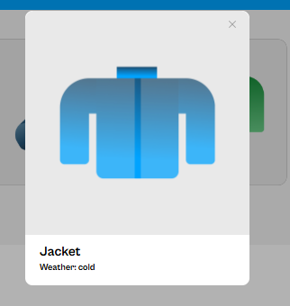

# WTWR

The WTWR app is a react-based application that helps users decide what to wear based on the current weather in their location. The app combines dynamic weather data with an intuitive interface to provide a seamless and adaptive user experience.

## Features

### Dynamic Weather Integration

- Retrieves real-time weather data using weather API.
- Displays the current temperature and location.

### Adaptive Clothing Recommendations

- Shows a collection of clothing items based on the current weather.
- Filters clothing cards dynamically according to temperature.

### Images

### Tech Stack

- HTML
- CSS
- REACT JS
- API
- NPM

### Deployment

- [Github Link](https://mdhamdan-13.github.io/se_project_react/)
